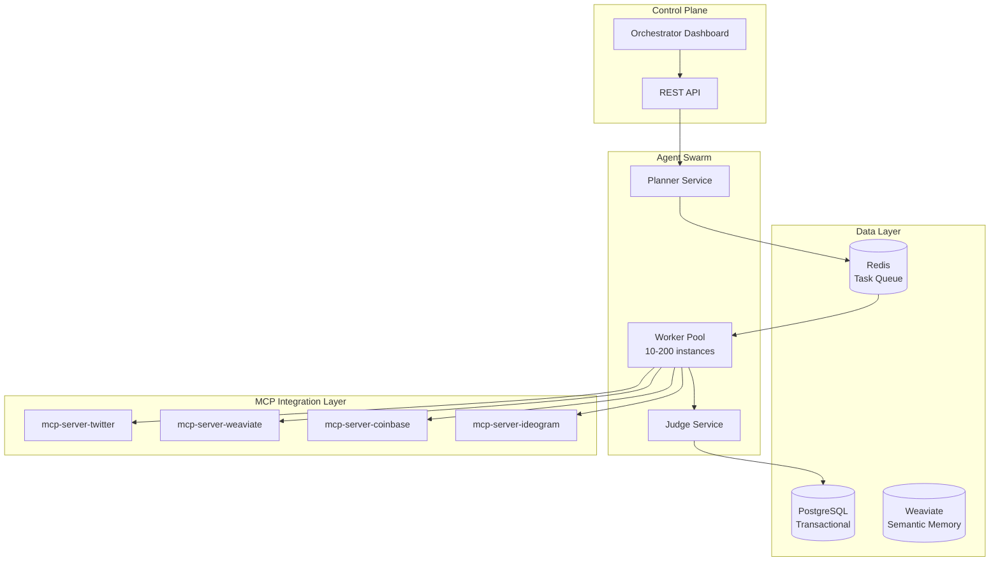

# Project Chimera: Technical Specification

**Version:** 1.0  
**Date:** February 4, 2026  
**Status:** Draft  

---

## 1. System Architecture Overview

### 1.1 High-Level Architecture



### 1.2 Component Responsibilities

| Component | Responsibility | Scaling Strategy | State |
|-----------|---------------|------------------|-------|
| **Planner** | Goal decomposition, task DAG creation | 1 per agent (vertical) | Stateful |
| **Worker** | Task execution, tool invocation | Horizontal auto-scaling | Stateless |
| **Judge** | Output validation, OCC enforcement | 1-5 per Planner | Stateless |
| **PostgreSQL** | Transactional data, audit logs | Primary + Read replicas | Persistent |
| **Weaviate** | Vector embeddings, semantic search | 3-node cluster | Persistent |
| **Redis** | Task queues, caching, pub/sub | Cluster with sharding | Ephemeral |

---

## 2. API Specifications

### 2.1 REST API Endpoints

**Base URL:** `https://api.chimera.dev/v1`

#### Agent Management

```http
POST /agents
Content-Type: application/json
Authorization: Bearer <jwt_token>

{
  "name": "FashionAI_Addis",
  "niche": "ethiopian_fashion",
  "region": "ethiopia",
  "persona": {
    "voice_traits": ["witty", "empathetic", "trendy"],
    "backstory": "Born in Addis Ababa, passionate about...",
    "core_beliefs": ["sustainability", "cultural_pride"]
  },
  "budget_daily_usd": 50.00
}

Response 201 Created:
{
  "agent_id": "550e8400-e29b-41d4-a716-446655440000",
  "wallet_address": "0x742d35Cc6634C0532925a3b844Bc9e7595f0bEb",
  "status": "paused",
  "created_at": "2026-02-04T14:30:00Z"
}
```

```http
GET /agents/{agent_id}
Authorization: Bearer <jwt_token>

Response 200 OK:
{
  "agent_id": "550e8400-e29b-41d4-a716-446655440000",
  "name": "FashionAI_Addis",
  "status": "active",
  "wallet_balance_usdc": 125.50,
  "posts_today": 12,
  "confidence_avg_24h": 0.87,
  "hitl_queue_depth": 2
}
```

```http
PATCH /agents/{agent_id}/status
Content-Type: application/json
Authorization: Bearer <jwt_token>

{
  "status": "active" | "paused" | "archived"
}

Response 200 OK
```

#### Campaign Management

```http
POST /agents/{agent_id}/campaigns
Content-Type: application/json

{
  "goal": "Promote new sneaker drop to Gen-Z audience",
  "start_date": "2026-02-05",
  "end_date": "2026-02-12",
  "priority": "high"
}

Response 201 Created:
{
  "campaign_id": "uuid",
  "task_dag": {
    "root": "Research trends",
    "children": [...]
  }
}
```

#### HITL Review Queue

```http
GET /review-queue
Authorization: Bearer <jwt_token>

Response 200 OK:
{
  "pending_items": [
    {
      "task_id": "uuid",
      "agent_id": "uuid",
      "content_type": "post",
      "content": {
        "caption": "Check out this new look...",
        "image_url": "https://..."
      },
      "confidence_score": 0.82,
      "reason": "new_brand_mention"
    }
  ]
}
```

```http
POST /review-queue/{task_id}/approve
Authorization: Bearer <jwt_token>

Response 200 OK
```

---

## 3. Database Schemas

### 3.1 PostgreSQL Schema

```sql
-- Users and Tenancy
CREATE TABLE accounts (
    id UUID PRIMARY KEY DEFAULT gen_random_uuid(),
    email VARCHAR(255) UNIQUE NOT NULL,
    subscription_tier VARCHAR(50) NOT NULL DEFAULT 'free',
    created_at TIMESTAMP NOT NULL DEFAULT NOW(),
    updated_at TIMESTAMP NOT NULL DEFAULT NOW()
);

-- Agents
CREATE TABLE agents (
    id UUID PRIMARY KEY DEFAULT gen_random_uuid(),
    account_id UUID NOT NULL REFERENCES accounts(id) ON DELETE CASCADE,
    name VARCHAR(255) NOT NULL,
    persona_name VARCHAR(255),
    niche VARCHAR(100),
    region VARCHAR(100),
    wallet_address VARCHAR(42) UNIQUE NOT NULL,
    status VARCHAR(50) NOT NULL DEFAULT 'paused',
    budget_daily_usd DECIMAL(10,2) NOT NULL DEFAULT 0.00,
    created_at TIMESTAMP NOT NULL DEFAULT NOW(),
    updated_at TIMESTAMP NOT NULL DEFAULT NOW(),
    
    CONSTRAINT agents_status_check CHECK (status IN ('active', 'paused', 'archived'))
);

-- Campaigns
CREATE TABLE campaigns (
    id UUID PRIMARY KEY DEFAULT gen_random_uuid(),
    agent_id UUID NOT NULL REFERENCES agents(id) ON DELETE CASCADE,
    goal_description TEXT NOT NULL,
    start_date DATE NOT NULL,
    end_date DATE,
    status VARCHAR(50) NOT NULL DEFAULT 'draft',
    priority VARCHAR(20) DEFAULT 'medium',
    created_at TIMESTAMP NOT NULL DEFAULT NOW(),
    updated_at TIMESTAMP NOT NULL DEFAULT NOW(),
    
    CONSTRAINT campaigns_status_check CHECK (status IN ('draft', 'active', 'paused', 'complete'))
);

-- Financial Transactions (Immutable Audit Log)
CREATE TABLE transactions (
    id UUID PRIMARY KEY DEFAULT gen_random_uuid(),
    agent_id UUID NOT NULL REFERENCES agents(id),
    transaction_hash VARCHAR(66) UNIQUE,
    amount_usd DECIMAL(10,2) NOT NULL,
    currency VARCHAR(10) NOT NULL DEFAULT 'USDC',
    direction VARCHAR(10) NOT NULL,
    to_address VARCHAR(42),
    from_address VARCHAR(42),
    memo TEXT,
    created_at TIMESTAMP NOT NULL DEFAULT NOW(),
    
    CONSTRAINT transactions_direction_check CHECK (direction IN ('inbound', 'outbound'))
);

-- Task Execution Log
CREATE TABLE task_log (
    id UUID PRIMARY KEY DEFAULT gen_random_uuid(),
    agent_id UUID NOT NULL REFERENCES agents(id),
    campaign_id UUID REFERENCES campaigns(id),
    task_type VARCHAR(50) NOT NULL,
    status VARCHAR(50) NOT NULL,
    confidence_score DECIMAL(3,2),
    reviewed_by_human BOOLEAN DEFAULT FALSE,
    result JSONB,
    error_message TEXT,
    created_at TIMESTAMP NOT NULL DEFAULT NOW(),
    completed_at TIMESTAMP,
    
    CONSTRAINT task_log_status_check CHECK (status IN ('pending', 'in_progress', 'complete', 'failed', 'rejected'))
);

-- Indexes for performance
CREATE INDEX idx_agents_account_id ON agents(account_id);
CREATE INDEX idx_agents_status ON agents(status) WHERE status = 'active';
CREATE INDEX idx_campaigns_agent_id ON campaigns(agent_id);
CREATE INDEX idx_transactions_agent_id ON transactions(agent_id);
CREATE INDEX idx_task_log_agent_id ON task_log(agent_id);
CREATE INDEX idx_task_log_created_at ON task_log(created_at DESC);
CREATE INDEX idx_task_log_reviewed ON task_log(reviewed_by_human) WHERE reviewed_by_human = TRUE;
```

### 3.2 Weaviate Schema

```python
# Agent Persona Collection
agent_persona_schema = {
    "class": "AgentPersona",
    "description": "Agent personality and background",
    "properties": [
        {
            "name": "agent_id",
            "dataType": ["string"],
            "description": "UUID reference to PostgreSQL"
        },
        {
            "name": "backstory",
            "dataType": ["text"],
            "description": "Agent narrative history"
        },
        {
            "name": "voice_traits",
            "dataType": ["text[]"],
            "description": "List of personality traits"
        },
        {
            "name": "core_beliefs",
            "dataType": ["text[]"],
            "description": "Ethical and behavioral guardrails"
        }
    ],
    "vectorizer": "text2vec-openai",
    "moduleConfig": {
        "text2vec-openai": {
            "model": "text-embedding-3-small"
        }
    }
}

# Interaction Memory Collection
interaction_memory_schema = {
    "class": "InteractionMemory",
    "description": "Agent interaction history",
    "properties": [
        {
            "name": "agent_id",
            "dataType": ["string"]
        },
        {
            "name": "platform",
            "dataType": ["string"],
            "description": "twitter, instagram, etc."
        },
        {
            "name": "interaction_type",
            "dataType": ["string"],
            "description": "post, reply, dm"
        },
        {
            "name": "content",
            "dataType": ["text"]
        },
        {
            "name": "engagement_score",
            "dataType": ["number"],
            "description": "Likes + comments + shares"
        },
        {
            "name": "timestamp",
            "dataType": ["date"]
        }
    ],
    "vectorizer": "text2vec-openai"
}
```

---

## 4. MCP Tool Specifications

### 4.1 Twitter MCP Server

```json
{
  "name": "post_tweet",
  "description": "Publishes a tweet to Twitter/X",
  "inputSchema": {
    "type": "object",
    "properties": {
      "text": {
        "type": "string",
        "maxLength": 280,
        "description": "Tweet content"
      },
      "media_urls": {
        "type": "array",
        "items": {"type": "string"},
        "maxItems": 4
      },
      "reply_to": {
        "type": "string",
        "description": "Tweet ID if this is a reply"
      }
    },
    "required": ["text"]
  }
}
```

### 4.2 Weaviate MCP Server

```json
{
  "name": "search_memory",
  "description": "Semantic search over agent memories",
  "inputSchema": {
    "type": "object",
    "properties": {
      "agent_id": {"type": "string"},
      "query": {"type": "string"},
      "top_k": {"type": "integer", "default": 5},
      "time_filter": {
        "type": "object",
        "properties": {
          "start_date": {"type": "string"},
          "end_date": {"type": "string"}
        }
      }
    },
    "required": ["agent_id", "query"]
  }
}
```

---

## 5. Task Schema (Redis Queue)

```json
{
  "task_id": "uuid-v4-string",
  "task_type": "generate_content | reply_comment | execute_transaction",
  "agent_id": "uuid",
  "campaign_id": "uuid",
  "priority": "high | medium | low",
  "context": {
    "goal_description": "string",
    "persona_constraints": ["string"],
    "required_resources": ["mcp://twitter/mentions/123"]
  },
  "state_version": 42,
  "created_at": "2026-02-04T14:30:00Z",
  "assigned_worker_id": "worker-pod-123",
  "status": "pending | in_progress | review | complete"
}
```

---

## 6. Infrastructure Requirements

### 6.1 Kubernetes Resources

```yaml
# Planner Deployment
apiVersion: apps/v1
kind: Deployment
metadata:
  name: chimera-planner
spec:
  replicas: 10  # 1 per active agent initially
  selector:
    matchLabels:
      app: chimera-planner
  template:
    spec:
      containers:
      - name: planner
        image: chimera/planner:latest
        resources:
          requests:
            memory: "512Mi"
            cpu: "250m"
          limits:
            memory: "1Gi"
            cpu: "500m"
        env:
        - name: GEMINI_API_KEY
          valueFrom:
            secretKeyRef:
              name: llm-credentials
              key: gemini-key
```

### 6.2 Cost Estimates

| Component | Configuration | Monthly Cost (1,000 agents) |
|-----------|--------------|----------------------------|
| **Compute** | 10 Planners (t3.medium) | $350 |
| **Compute** | 50 Workers (t3.small, spot) | $200 |
| **PostgreSQL** | RDS db.t3.large | $200 |
| **Weaviate** | 3-node K8s cluster | $150 |
| **Redis** | ElastiCache cache.t3.medium | $100 |
| **LLM APIs** | Gemini + Claude | $8,000 |
| **Storage** | S3 + EBS | $500 |
| **Total** | | **~$9,500/month** |

---

## Document Status

**Status:** ✅ Draft Complete  
**Next:** Create openclaw_integration.md

