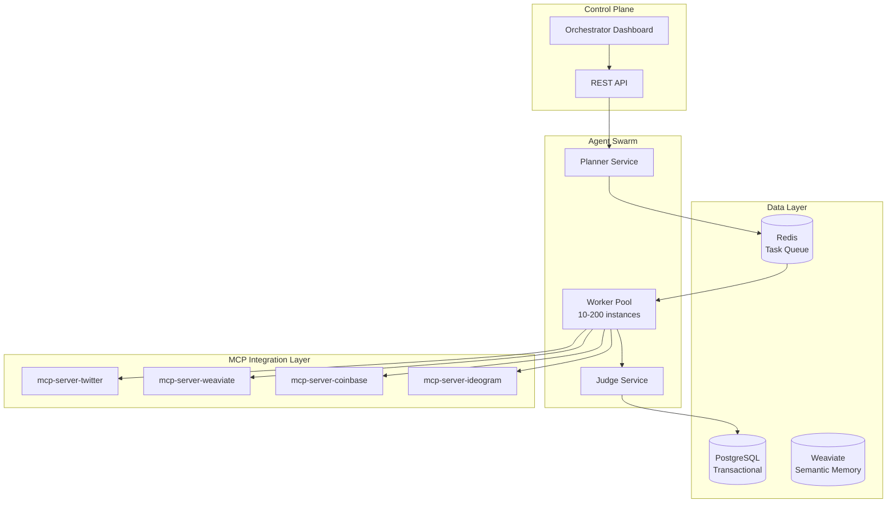

# Project Chimera: Technical Specification

**Version:** 1.0  
**Date:** February 4, 2026  
**Status:** Draft  


Note on examples: All code blocks in this document are illustrative and non-binding unless a section explicitly marks them as normative requirements.


---

## 1. System Architecture Overview

### 1.1 High-Level Architecture



### 1.2 Component Responsibilities

| Component | Responsibility | Scaling Strategy | State |
|-----------|---------------|------------------|-------|
| **Planner** | Goal decomposition, task DAG creation | 1 per agent (vertical) | Stateful |
| **Worker** | Task execution, tool invocation | Horizontal auto-scaling | Stateless |
| **Judge** | Output validation, OCC enforcement | 1-5 per Planner | Stateless |
| **PostgreSQL** | Transactional data, audit logs | Primary + Read replicas | Persistent |
| **Weaviate** | Vector embeddings, semantic search | 3-node cluster | Persistent |
| **Redis** | Task queues, caching, pub/sub | Cluster with sharding | Ephemeral |

---

## 2. API Specifications

### 2.1 REST API Endpoints

**Base URL:** `https://api.chimera.dev/v1`

#### Agent Management

```http
POST /agents
Content-Type: application/json
Authorization: Bearer <jwt_token>

{
  "name": "FashionAI_Addis",
  "niche": "ethiopian_fashion",
  "region": "ethiopia",
  "persona": {
    "voice_traits": ["witty", "empathetic", "trendy"],
    "backstory": "Born in Addis Ababa, passionate about...",
    "core_beliefs": ["sustainability", "cultural_pride"]
  },
  "budget_daily_usd": 50.00
}

Response 201 Created:
{
  "agent_id": "550e8400-e29b-41d4-a716-446655440000",
  "wallet_address": "0x742d35Cc6634C0532925a3b844Bc9e7595f0bEb",
  "status": "paused",
  "created_at": "2026-02-04T14:30:00Z"
}
```

```http
GET /agents/{agent_id}
Authorization: Bearer <jwt_token>

Response 200 OK:
{
  "agent_id": "550e8400-e29b-41d4-a716-446655440000",
  "name": "FashionAI_Addis",
  "status": "active",
  "wallet_balance_usdc": 125.50,
  "posts_today": 12,
  "confidence_avg_24h": 0.87,
  "hitl_queue_depth": 2
}
```

```http
PATCH /agents/{agent_id}/status
Content-Type: application/json
Authorization: Bearer <jwt_token>

{
  "status": "active" | "paused" | "archived"
}

Response 200 OK
```

#### Campaign Management

```http
POST /agents/{agent_id}/campaigns
Content-Type: application/json

{
  "goal": "Promote new sneaker drop to Gen-Z audience",
  "start_date": "2026-02-05",
  "end_date": "2026-02-12",
  "priority": "high"
}

Response 201 Created:
{
  "campaign_id": "uuid",
  "task_dag": {
    "root": "Research trends",
    "children": [...]
  }
}
```

#### HITL Review Queue

```http
GET /review-queue
Authorization: Bearer <jwt_token>

Response 200 OK:
{
  "pending_items": [
    {
      "task_id": "uuid",
      "agent_id": "uuid",
      "content_type": "post",
      "content": {
        "caption": "Check out this new look...",
        "image_url": "https://..."
      },
      "confidence_score": 0.82,
      "reason": "new_brand_mention"
    }
  ]
}
```

```http
POST /review-queue/{task_id}/approve
Authorization: Bearer <jwt_token>

Response 200 OK
```

---

## 3. Database Schemas

### 3.1 PostgreSQL Schema

```sql
-- Users and Tenancy
CREATE TABLE accounts (
    id UUID PRIMARY KEY DEFAULT gen_random_uuid(),
    email VARCHAR(255) UNIQUE NOT NULL,
    subscription_tier VARCHAR(50) NOT NULL DEFAULT 'free',
    created_at TIMESTAMP NOT NULL DEFAULT NOW(),
    updated_at TIMESTAMP NOT NULL DEFAULT NOW()
);

-- Agents
CREATE TABLE agents (
    id UUID PRIMARY KEY DEFAULT gen_random_uuid(),
    account_id UUID NOT NULL REFERENCES accounts(id) ON DELETE CASCADE,
    name VARCHAR(255) NOT NULL,
    persona_name VARCHAR(255),
    niche VARCHAR(100),
    region VARCHAR(100),
    wallet_address VARCHAR(42) UNIQUE NOT NULL,
    status VARCHAR(50) NOT NULL DEFAULT 'paused',
    budget_daily_usd DECIMAL(10,2) NOT NULL DEFAULT 0.00,
    created_at TIMESTAMP NOT NULL DEFAULT NOW(),
    updated_at TIMESTAMP NOT NULL DEFAULT NOW(),
    
    CONSTRAINT agents_status_check CHECK (status IN ('active', 'paused', 'archived'))
);

-- Campaigns
CREATE TABLE campaigns (
    id UUID PRIMARY KEY DEFAULT gen_random_uuid(),
    agent_id UUID NOT NULL REFERENCES agents(id) ON DELETE CASCADE,
    goal_description TEXT NOT NULL,
    start_date DATE NOT NULL,
    end_date DATE,
    status VARCHAR(50) NOT NULL DEFAULT 'draft',
    priority VARCHAR(20) DEFAULT 'medium',
    created_at TIMESTAMP NOT NULL DEFAULT NOW(),
    updated_at TIMESTAMP NOT NULL DEFAULT NOW(),
    
    CONSTRAINT campaigns_status_check CHECK (status IN ('draft', 'active', 'paused', 'complete'))
);

-- Financial Transactions (Immutable Audit Log)
CREATE TABLE transactions (
    id UUID PRIMARY KEY DEFAULT gen_random_uuid(),
    agent_id UUID NOT NULL REFERENCES agents(id),
    transaction_hash VARCHAR(66) UNIQUE,
    amount_usd DECIMAL(10,2) NOT NULL,
    currency VARCHAR(10) NOT NULL DEFAULT 'USDC',
    direction VARCHAR(10) NOT NULL,
    to_address VARCHAR(42),
    from_address VARCHAR(42),
    memo TEXT,
    created_at TIMESTAMP NOT NULL DEFAULT NOW(),
    
    CONSTRAINT transactions_direction_check CHECK (direction IN ('inbound', 'outbound'))
);

-- Task Execution Log
CREATE TABLE task_log (
    id UUID PRIMARY KEY DEFAULT gen_random_uuid(),
    agent_id UUID NOT NULL REFERENCES agents(id),
    campaign_id UUID REFERENCES campaigns(id),
    task_type VARCHAR(50) NOT NULL,
    status VARCHAR(50) NOT NULL,
    confidence_score DECIMAL(3,2),
    reviewed_by_human BOOLEAN DEFAULT FALSE,
    result JSONB,
    error_message TEXT,
    created_at TIMESTAMP NOT NULL DEFAULT NOW(),
    completed_at TIMESTAMP,
    
    CONSTRAINT task_log_status_check CHECK (status IN ('pending', 'in_progress', 'complete', 'failed', 'rejected'))
);

-- Indexes for performance
CREATE INDEX idx_agents_account_id ON agents(account_id);
CREATE INDEX idx_agents_status ON agents(status) WHERE status = 'active';
CREATE INDEX idx_campaigns_agent_id ON campaigns(agent_id);
CREATE INDEX idx_transactions_agent_id ON transactions(agent_id);
CREATE INDEX idx_task_log_agent_id ON task_log(agent_id);
CREATE INDEX idx_task_log_created_at ON task_log(created_at DESC);
CREATE INDEX idx_task_log_reviewed ON task_log(reviewed_by_human) WHERE reviewed_by_human = TRUE;
```

### 3.2 Weaviate Schema

```python
# Agent Persona Collection
agent_persona_schema = {
    "class": "AgentPersona",
    "description": "Agent personality and background",
    "properties": [
        {
            "name": "agent_id",
            "dataType": ["string"],
            "description": "UUID reference to PostgreSQL"
        },
        {
            "name": "backstory",
            "dataType": ["text"],
            "description": "Agent narrative history"
        },
        {
            "name": "voice_traits",
            "dataType": ["text[]"],
            "description": "List of personality traits"
        },
        {
            "name": "core_beliefs",
            "dataType": ["text[]"],
            "description": "Ethical and behavioral guardrails"
        }
    ],
    "vectorizer": "text2vec-openai",
    "moduleConfig": {
        "text2vec-openai": {
            "model": "text-embedding-3-small"
        }
    }
}

# Interaction Memory Collection
interaction_memory_schema = {
    "class": "InteractionMemory",
    "description": "Agent interaction history",
    "properties": [
        {
            "name": "agent_id",
            "dataType": ["string"]
        },
        {
            "name": "platform",
            "dataType": ["string"],
            "description": "twitter, instagram, etc."
        },
        {
            "name": "interaction_type",
            "dataType": ["string"],
            "description": "post, reply, dm"
        },
        {
            "name": "content",
            "dataType": ["text"]
        },
        {
            "name": "engagement_score",
            "dataType": ["number"],
            "description": "Likes + comments + shares"
        },
        {
            "name": "timestamp",
            "dataType": ["date"]
        }
    ],
    "vectorizer": "text2vec-openai"
}
```

---

## 4. MCP Tool Specifications

### 4.1 Twitter MCP Server

```json
{
  "name": "post_tweet",
  "description": "Publishes a tweet to Twitter/X",
  "inputSchema": {
    "type": "object",
    "properties": {
      "text": {
        "type": "string",
        "maxLength": 280,
        "description": "Tweet content"
      },
      "media_urls": {
        "type": "array",
        "items": {"type": "string"},
        "maxItems": 4
      },
      "reply_to": {
        "type": "string",
        "description": "Tweet ID if this is a reply"
      }
    },
    "required": ["text"]
  }
}
```

### 4.2 Weaviate MCP Server

```json
{
  "name": "search_memory",
  "description": "Semantic search over agent memories",
  "inputSchema": {
    "type": "object",
    "properties": {
      "agent_id": {"type": "string"},
      "query": {"type": "string"},
      "top_k": {"type": "integer", "default": 5},
      "time_filter": {
        "type": "object",
        "properties": {
          "start_date": {"type": "string"},
          "end_date": {"type": "string"}
        }
      }
    },
    "required": ["agent_id", "query"]
  }
}
```

---

## 5. Task Schema (Redis Queue)

```json
{
  "task_id": "uuid-v4-string",
  "task_type": "generate_content | reply_comment | execute_transaction",
  "agent_id": "uuid",
  "campaign_id": "uuid",
  "priority": "high | medium | low",
  "context": {
    "goal_description": "string",
    "persona_constraints": ["string"],
    "required_resources": ["mcp://twitter/mentions/123"]
  },
  "state_version": 42,
  "created_at": "2026-02-04T14:30:00Z",
  "assigned_worker_id": "worker-pod-123",
  "status": "pending | in_progress | review | complete"
}
```

---

## 6. Infrastructure Requirements

### 6.1 Kubernetes Resources

```yaml
# Planner Deployment
apiVersion: apps/v1
kind: Deployment
metadata:
  name: chimera-planner
spec:
  replicas: 10  # 1 per active agent initially
  selector:
    matchLabels:
      app: chimera-planner
  template:
    spec:
      containers:
      - name: planner
        image: chimera/planner:latest
        resources:
          requests:
            memory: "512Mi"
            cpu: "250m"
          limits:
            memory: "1Gi"
            cpu: "500m"
        env:
        - name: GEMINI_API_KEY
          valueFrom:
            secretKeyRef:
              name: llm-credentials
              key: gemini-key
```

### 6.2 Cost Estimates

| Component | Configuration | Monthly Cost (1,000 agents) |
|-----------|--------------|----------------------------|
| **Compute** | 10 Planners (t3.medium) | $350 |
| **Compute** | 50 Workers (t3.small, spot) | $200 |
| **PostgreSQL** | RDS db.t3.large | $200 |
| **Weaviate** | 3-node K8s cluster | $150 |
| **Redis** | ElastiCache cache.t3.medium | $100 |
| **LLM APIs** | Gemini + Claude | $8,000 |
| **Storage** | S3 + EBS | $500 |
| **Total** | | **~$9,500/month** |

---

## 7. Agent Runtime Architecture

### 7.1 Planner Service Implementation

```python
# src/planner/agent_planner.py

from typing import List, Dict
from dataclasses import dataclass
from enum import Enum

class TaskPriority(Enum):
    HIGH = "high"
    MEDIUM = "medium"
    LOW = "low"

@dataclass
class Task:
    task_id: str
    task_type: str
    agent_id: str
    priority: TaskPriority
    context: Dict
    dependencies: List[str]
    created_at: datetime

class AgentPlanner:
    """
    Planner service: Decomposes goals into executable tasks
    """
    
    def __init__(self, agent_id: str, redis_client, llm_client):
        self.agent_id = agent_id
        self.redis = redis_client
        self.llm = llm_client
        
    async def decompose_goal(self, goal: str) -> List[Task]:
        """
        Uses LLM to break down high-level goal into task DAG
        
        Example:
            Input: "Promote sustainable fashion week"
            Output: [
                Task(type="research_trends", priority=HIGH),
                Task(type="generate_content", priority=HIGH, depends_on=["research_trends"]),
                Task(type="publish_content", priority=MEDIUM, depends_on=["generate_content"])
            ]
        """
        prompt = self._build_planning_prompt(goal)
        task_dag = await self.llm.generate_structured_output(
            prompt=prompt,
            schema=TaskDAGSchema
        )
        return self._validate_and_enqueue_tasks(task_dag)
    
    async def poll_resources(self):
        """
        Continuously polls MCP Resources for new trends/mentions
        Runs every 4 hours for trends, every 10 minutes for mentions
        """
        while self.agent_status == "active":
            trends = await self.mcp_client.call_tool(
                "get_trending_topics",
                {"region": self.agent.region, "niche": self.agent.niche}
            )
            
            for trend in trends:
                if self._is_relevant(trend):
                    task = self._create_content_task(trend)
                    await self.enqueue_task(task)
            
            await asyncio.sleep(14400)  # 4 hours
```

### 7.2 Worker Service Implementation

```python
# src/worker/task_executor.py

class TaskWorker:
    """
    Stateless worker: Executes tasks from Redis queue
    """
    
    def __init__(self, worker_id: str, mcp_client, judge_client):
        self.worker_id = worker_id
        self.mcp = mcp_client
        self.judge = judge_client
        
    async def execute_task(self, task: Task) -> TaskResult:
        """
        Main execution loop with error handling and retries
        """
        try:
            # Step 1: Retrieve relevant memories
            memories = await self.mcp.call_tool(
                "search_memory",
                {"agent_id": task.agent_id, "query": task.context["topic"]}
            )
            
            # Step 2: Generate content using LLM + MCP tools
            if task.task_type == "generate_content":
                result = await self._generate_content(task, memories)
            elif task.task_type == "reply_comment":
                result = await self._reply_to_comment(task, memories)
            elif task.task_type == "execute_transaction":
                result = await self._execute_payment(task)
            
            # Step 3: Send to Judge for validation
            judgment = await self.judge.validate(result, task.context)
            
            if judgment.approved:
                return TaskResult(status="complete", output=result)
            else:
                return TaskResult(status="rejected", reason=judgment.reason)
                
        except RetryableError as e:
            return TaskResult(status="retry", error=str(e))
        except FatalError as e:
            return TaskResult(status="failed", error=str(e))
    
    async def _generate_content(self, task: Task, memories: List[Memory]) -> ContentOutput:
        """
        Generate social media post with caption + image
        """
        # Build context-aware prompt
        prompt = self._build_content_prompt(
            persona=task.context["persona"],
            topic=task.context["topic"],
            memories=memories
        )
        
        # Generate caption
        caption = await self.llm.generate(prompt)
        
        # Generate image using MCP tool
        image_result = await self.mcp.call_tool(
            "generate_image",
            {
                "prompt": f"{caption} in style of {task.context['persona']['visual_style']}",
                "character_lora": task.context["persona"]["character_id"]
            }
        )
        
        return ContentOutput(
            caption=caption,
            image_url=image_result["url"],
            confidence_score=self._calculate_confidence(caption, image_result)
        )
```

### 7.3 Judge Service Implementation

```python
# src/judge/output_validator.py

class OutputJudge:
    """
    Judge service: Validates worker outputs against quality criteria
    """
    
    def __init__(self, llm_client):
        self.llm = llm_client
        
    async def validate(self, output: ContentOutput, context: Dict) -> Judgment:
        """
        Multi-criteria validation with confidence scoring
        """
        checks = await asyncio.gather(
            self._check_persona_consistency(output, context),
            self._check_content_safety(output),
            self._check_brand_alignment(output, context),
            self._check_technical_quality(output)
        )
        
        confidence_score = self._aggregate_confidence(checks)
        
        if confidence_score >= 0.90:
            return Judgment(approved=True, confidence=confidence_score, route="auto")
        elif confidence_score >= 0.70:
            return Judgment(approved=False, confidence=confidence_score, route="hitl")
        else:
            return Judgment(approved=False, confidence=confidence_score, route="reject")
    
    async def _check_persona_consistency(self, output: ContentOutput, context: Dict) -> float:
        """
        Uses LLM to verify caption matches agent's voice/tone
        """
        prompt = f"""
        Agent Persona: {context['persona']}
        Generated Caption: {output.caption}
        
        Score how well this caption matches the persona's voice (0.0-1.0):
        """
        score = await self.llm.generate_score(prompt)
        return score
```

---

## 8. MCP Server Deployment

### 8.1 Required MCP Servers

| MCP Server | Purpose | Hosting | Cost |
|------------|---------|---------|------|
| `mcp-server-twitter` | Twitter API integration | Self-hosted (K8s) | Free |
| `mcp-server-weaviate` | Semantic memory access | Self-hosted (K8s) | Free |
| `mcp-server-coinbase` | Wallet operations (AgentKit) | Self-hosted (K8s) | Free |
| `mcp-server-ideogram` | Image generation | External API | $0.08/image |
| `mcp-server-news` | News aggregation | Self-hosted (K8s) | Free |

### 8.2 MCP Server Configuration

```yaml
# k8s/mcp-twitter-deployment.yaml

apiVersion: apps/v1
kind: Deployment
metadata:
  name: mcp-server-twitter
spec:
  replicas: 3
  selector:
    matchLabels:
      app: mcp-twitter
  template:
    metadata:
      labels:
        app: mcp-twitter
    spec:
      containers:
      - name: mcp-twitter
        image: chimera/mcp-twitter:latest
        ports:
        - containerPort: 3000
        env:
        - name: TWITTER_API_KEY
          valueFrom:
            secretKeyRef:
              name: twitter-credentials
              key: api-key
        - name: TWITTER_API_SECRET
          valueFrom:
            secretKeyRef:
              name: twitter-credentials
              key: api-secret
        resources:
          requests:
            memory: "256Mi"
            cpu: "100m"
          limits:
            memory: "512Mi"
            cpu: "250m"
        livenessProbe:
          httpGet:
            path: /health
            port: 3000
          initialDelaySeconds: 30
          periodSeconds: 10
---
apiVersion: v1
kind: Service
metadata:
  name: mcp-twitter-service
spec:
  selector:
    app: mcp-twitter
  ports:
  - protocol: TCP
    port: 3000
    targetPort: 3000
  type: ClusterIP
```

---

## 9. Observability & Monitoring

### 9.1 Metrics Collection

```python
# src/common/metrics.py

from prometheus_client import Counter, Histogram, Gauge

# Task metrics
task_counter = Counter(
    'chimera_tasks_total',
    'Total tasks processed',
    ['agent_id', 'task_type', 'status']
)

task_duration = Histogram(
    'chimera_task_duration_seconds',
    'Task execution duration',
    ['task_type']
)

# Confidence metrics
confidence_gauge = Gauge(
    'chimera_confidence_score',
    'Average confidence score (24h rolling)',
    ['agent_id']
)

# Financial metrics
spend_counter = Counter(
    'chimera_spend_usd_total',
    'Total spend in USD',
    ['agent_id', 'category']
)

# Queue depth
queue_depth_gauge = Gauge(
    'chimera_queue_depth',
    'Number of tasks in queue',
    ['queue_name']
)
```

### 9.2 Logging Strategy

```python
# src/common/logger.py

import structlog

logger = structlog.get_logger()

# Structured logging for all agent actions
logger.info(
    "task_completed",
    agent_id=agent.id,
    task_id=task.id,
    task_type=task.type,
    confidence=result.confidence,
    reviewed_by_human=False,
    execution_time_ms=duration,
    reasoning_trace=result.reasoning,
    timestamp=datetime.utcnow().isoformat()
)
```

### 9.3 Distributed Tracing

```yaml
# OpenTelemetry configuration

instrumentation:
  - asyncio
  - aiohttp
  - redis
  - postgresql
  
exporters:
  - type: jaeger
    endpoint: "http://jaeger-collector:14268/api/traces"
  - type: honeycomb
    api_key: ${HONEYCOMB_API_KEY}
    dataset: "chimera-production"
```

---

## 10. Security Architecture

### 10.1 Authentication & Authorization

```python
# src/api/auth.py

from fastapi import Depends, HTTPException
from fastapi.security import HTTPBearer, HTTPAuthorizationCredentials
import jwt

security = HTTPBearer()

async def verify_jwt_token(credentials: HTTPAuthorizationCredentials = Depends(security)):
    """
    Validates JWT tokens for API requests
    """
    try:
        payload = jwt.decode(
            credentials.credentials,
            settings.JWT_SECRET,
            algorithms=["HS256"]
        )
        return payload
    except jwt.ExpiredSignatureError:
        raise HTTPException(status_code=401, detail="Token expired")
    except jwt.InvalidTokenError:
        raise HTTPException(status_code=401, detail="Invalid token")

# Role-based access control
class Permission(Enum):
    READ_AGENTS = "read:agents"
    WRITE_AGENTS = "write:agents"
    APPROVE_HITL = "approve:hitl"
    ADMIN = "admin:*"

def require_permission(permission: Permission):
    def decorator(func):
        async def wrapper(*args, token_payload=Depends(verify_jwt_token), **kwargs):
            if permission.value not in token_payload.get("permissions", []):
                raise HTTPException(status_code=403, detail="Insufficient permissions")
            return await func(*args, **kwargs)
        return wrapper
    return decorator
```

### 10.2 Secrets Management

```yaml
# k8s/secrets.yaml (example - DO NOT commit actual secrets)

apiVersion: v1
kind: Secret
metadata:
  name: llm-credentials
type: Opaque
data:
  gemini-key: <base64-encoded>
  claude-key: <base64-encoded>
---
apiVersion: v1
kind: Secret
metadata:
  name: wallet-encryption-key
type: Opaque
data:
  encryption-key: <base64-encoded>
```

### 10.3 Network Security

```yaml
# k8s/network-policy.yaml

apiVersion: networking.k8s.io/v1
kind: NetworkPolicy
metadata:
  name: worker-egress-policy
spec:
  podSelector:
    matchLabels:
      component: worker
  policyTypes:
  - Egress
  egress:
  # Allow access to MCP servers only
  - to:
    - podSelector:
        matchLabels:
          type: mcp-server
    ports:
    - protocol: TCP
      port: 3000
  # Allow access to databases
  - to:
    - podSelector:
        matchLabels:
          component: database
  # Block all other egress
```

---

## 11. Disaster Recovery & Backup

### 11.1 Backup Strategy

| Component | Backup Frequency | Retention | Recovery Time Objective (RTO) |
|-----------|------------------|-----------|-------------------------------|
| PostgreSQL | Every 6 hours | 30 days | < 1 hour |
| Weaviate | Daily | 14 days | < 2 hours |
| Redis | No backup (ephemeral) | N/A | N/A (rebuild from PostgreSQL) |
| Agent Configs | Real-time (Git) | Infinite | < 5 minutes |

### 11.2 Disaster Recovery Procedures

```bash
# PostgreSQL Point-in-Time Recovery

# 1. Restore from latest base backup
pg_restore -d chimera_production /backups/base_2026-02-05_00:00.dump

# 2. Apply WAL logs to desired timestamp
pg_receivewal -D /var/lib/postgresql/wal_archive \
  --until='2026-02-05 12:30:00+00'

# 3. Verify data integrity
psql -d chimera_production -c "SELECT COUNT(*) FROM agents;"
```

### 11.3 High Availability Configuration

```yaml
# PostgreSQL Patroni Cluster (3-node)

apiVersion: acid.zalan.do/v1
kind: postgresql
metadata:
  name: chimera-postgres-cluster
spec:
  teamId: "chimera"
  volume:
    size: 100Gi
  numberOfInstances: 3
  users:
    chimera_app:
      - superuser
      - createdb
  databases:
    chimera_production: chimera_app
  postgresql:
    version: "15"
    parameters:
      max_connections: "500"
      shared_buffers: "4GB"
```

---

## 12. Performance Optimization

### 12.1 Database Optimization

```sql
-- Create indexes for common queries

-- Agent queries by status
CREATE INDEX CONCURRENTLY idx_agents_status_active 
ON agents(status) WHERE status = 'active';

-- Task log queries by agent and date
CREATE INDEX CONCURRENTLY idx_task_log_agent_created 
ON task_log(agent_id, created_at DESC);

-- Transaction queries by agent
CREATE INDEX CONCURRENTLY idx_transactions_agent_created 
ON transactions(agent_id, created_at DESC);

-- Partition task_log by date for faster queries
CREATE TABLE task_log_2026_02 PARTITION OF task_log
FOR VALUES FROM ('2026-02-01') TO ('2026-03-01');
```

### 12.2 Caching Strategy

```python
# src/common/cache.py

import redis
import pickle
from functools import wraps

redis_client = redis.Redis(host='redis-cluster', port=6379, db=0)

def cache_result(ttl_seconds: int = 300):
    """
    Decorator for caching function results in Redis
    """
    def decorator(func):
        @wraps(func)
        async def wrapper(*args, **kwargs):
            cache_key = f"{func.__name__}:{pickle.dumps((args, kwargs))}"
            
            # Try cache first
            cached = redis_client.get(cache_key)
            if cached:
                return pickle.loads(cached)
            
            # Cache miss - execute function
            result = await func(*args, **kwargs)
            redis_client.setex(cache_key, ttl_seconds, pickle.dumps(result))
            return result
        return wrapper
    return decorator

# Usage
@cache_result(ttl_seconds=600)
async def get_agent_persona(agent_id: str):
    # Expensive database query
    return await db.fetch_persona(agent_id)
```

### 12.3 Worker Pool Auto-Scaling

```yaml
# k8s/worker-hpa.yaml

apiVersion: autoscaling/v2
kind: HorizontalPodAutoscaler
metadata:
  name: worker-pool-autoscaler
spec:
  scaleTargetRef:
    apiVersion: apps/v1
    kind: Deployment
    name: chimera-worker
  minReplicas: 10
  maxReplicas: 200
  metrics:
  - type: Pods
    pods:
      metric:
        name: queue_depth
      target:
        type: AverageValue
        averageValue: "5"  # Scale up if >5 tasks per worker
  - type: Resource
    resource:
      name: cpu
      target:
        type: Utilization
        averageUtilization: 70
```

---

## 13. CI/CD Pipeline

### 13.1 GitHub Actions Workflow

```yaml
# .github/workflows/deploy.yml

name: Deploy to Production

on:
  push:
    branches: [main]

jobs:
  test:
    runs-on: ubuntu-latest
    steps:
      - uses: actions/checkout@v3
      - name: Set up Python
        uses: actions/setup-python@v4
        with:
          python-version: '3.11'
      - name: Install dependencies
        run: |
          pip install uv
          uv pip install -r requirements.txt
      - name: Run tests
        run: pytest tests/ --cov=src --cov-report=xml
      - name: Spec validation
        run: make spec-check
  
  build:
    needs: test
    runs-on: ubuntu-latest
    steps:
      - name: Build Docker images
        run: |
          docker build -t chimera/planner:${{ github.sha }} -f docker/Planner.Dockerfile .
          docker build -t chimera/worker:${{ github.sha }} -f docker/Worker.Dockerfile .
          docker build -t chimera/judge:${{ github.sha }} -f docker/Judge.Dockerfile .
      - name: Push to registry
        run: |
          docker push chimera/planner:${{ github.sha }}
          docker push chimera/worker:${{ github.sha }}
          docker push chimera/judge:${{ github.sha }}
  
  deploy:
    needs: build
    runs-on: ubuntu-latest
    steps:
      - name: Deploy to Kubernetes
        run: |
          kubectl set image deployment/planner planner=chimera/planner:${{ github.sha }}
          kubectl set image deployment/worker worker=chimera/worker:${{ github.sha }}
          kubectl set image deployment/judge judge=chimera/judge:${{ github.sha }}
          kubectl rollout status deployment/planner
```

---

## Document Status

**Status:** ✅ Complete - Ready for Implementation  
**Version:** 2.0  
**Last Updated:** February 5, 2026

**Next Steps:**
- [ ] Review with Technical Lead
- [ ] Set up development environment (K8s cluster, databases)
- [ ] Implement core agent runtime (Planner, Worker, Judge)
- [ ] Deploy MCP servers
- [ ] Configure monitoring and alerting

**Changelog:**
- v2.0 (2026-02-05): Added agent runtime architecture, MCP deployment, observability, security, disaster recovery, performance optimization, CI/CD pipeline
- v1.0 (2026-02-04): Initial draft with API specs, database schemas, infrastructure

---

**End of Technical Specification**

